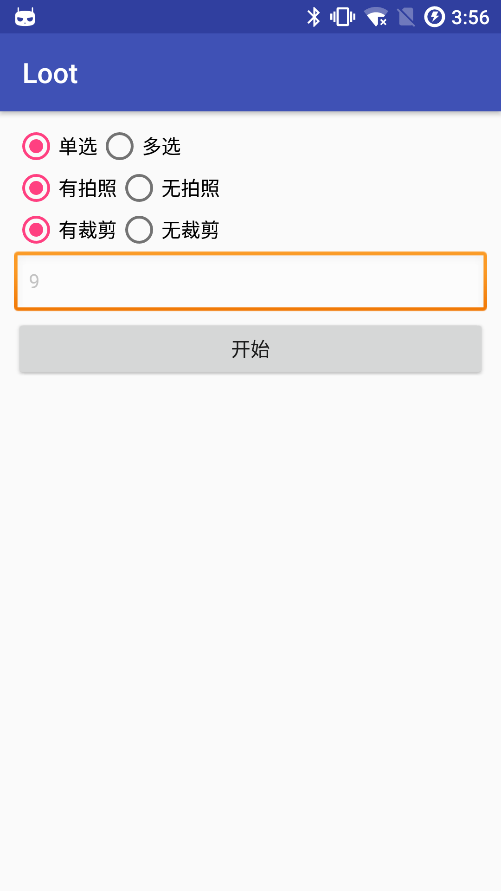
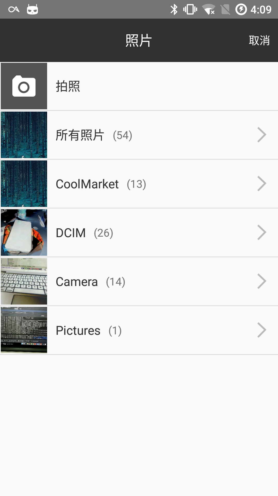
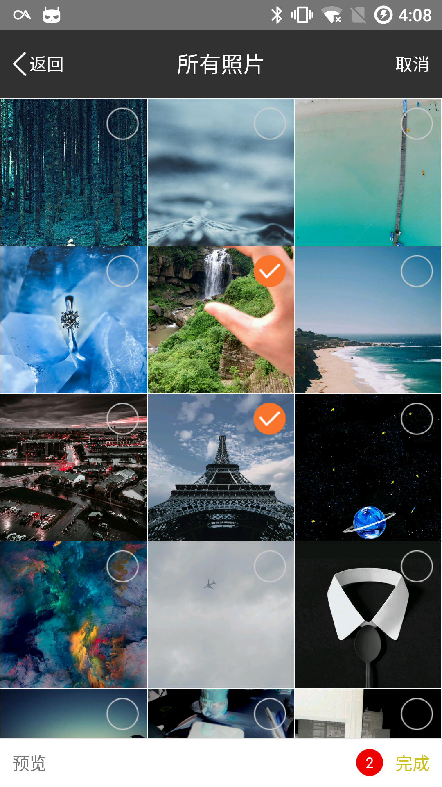
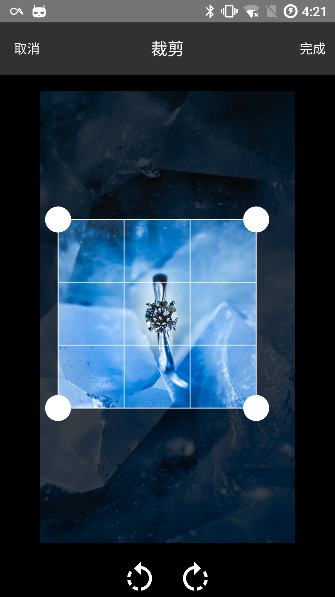

# Loot


Multilpe and Single ImageChoice Library

提供多选和单选图片以及图片裁剪的功能.


  | |  | |
  |:------------------------------------:|:-------------------------------------:|:------------------------------------:|
  | |  |                                      |

`compile 'com.twisty:loot:1.0.1'`

```

Loot.getInstance()
    .setSingle(false)
    .setHasCamera(true)
    .setHasCrop(false)
    .setMaxCount(9)
    .start(this, data -> {});
```
