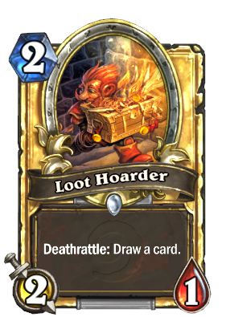

# Loot


Multilpe and Single ImageChoice Library

提供多选和单选图片以及图片裁剪的功能.


```
Loot.getInstance()
    .setSingle(false)
    .setHasCamera(true)
    .setHasCrop(false)
    .setMaxCount(9)
    .start(this, data -> {});
```
